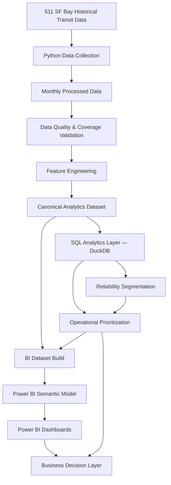
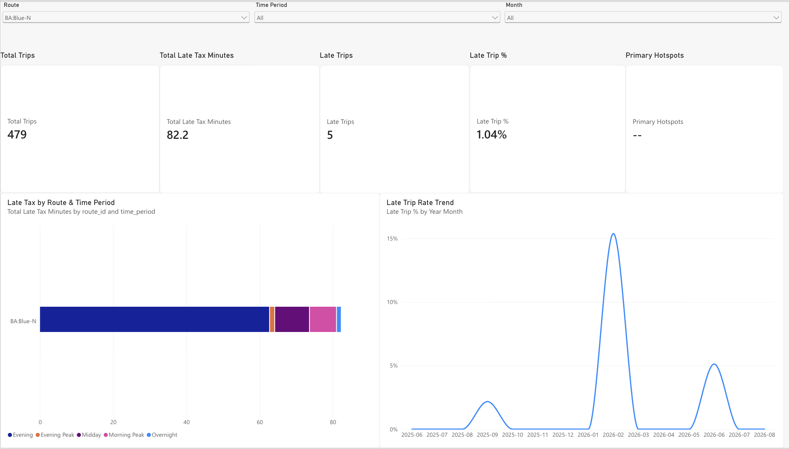
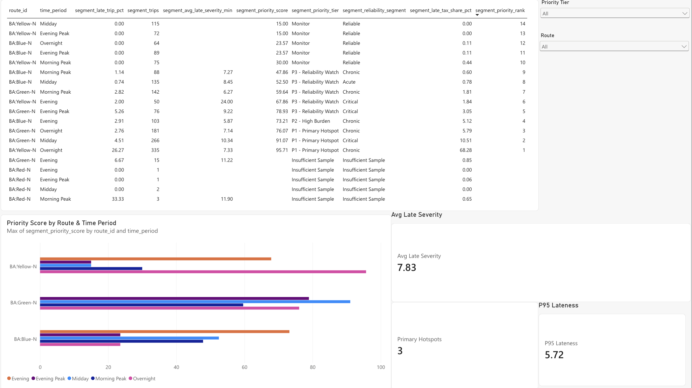
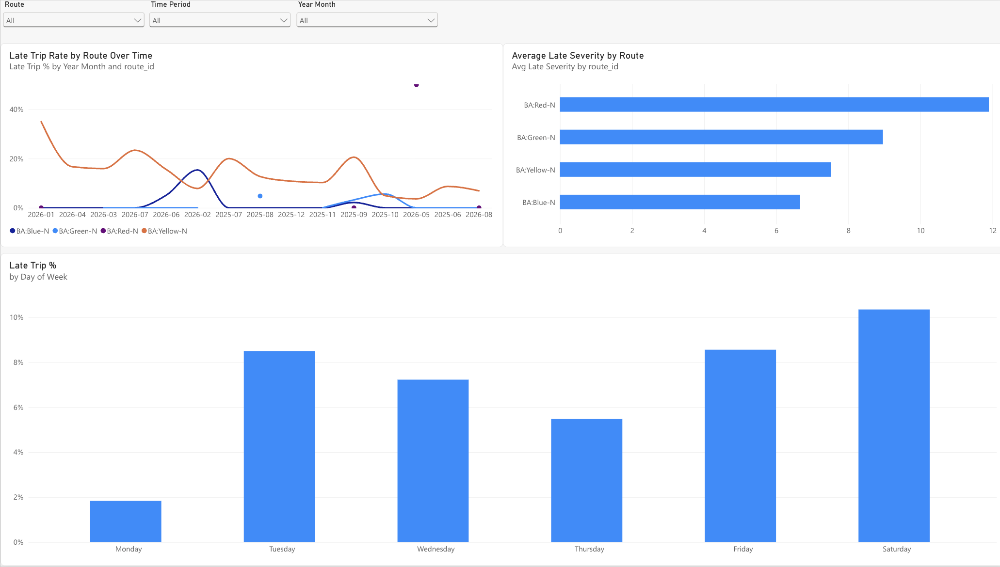
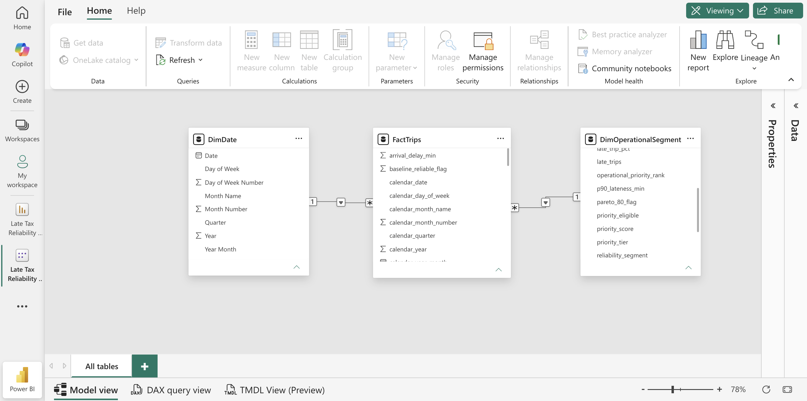

# The Late Tax

### Quantifying where transit unreliability creates the largest excess-delay burden

The Late Tax is an end-to-end transit reliability analytics project that transforms historical service observations into a reproducible decision-support pipeline using **Python, SQL/DuckDB, and Power BI**.

Rather than asking only whether transit is late, the project asks a more operationally useful question:

> **Where should reliability improvement efforts be prioritized to address the largest share of measured excess-delay burden?**

The analysis shows that reliability problems are highly concentrated. Across 1,813 observed trips, **68.28% of total measured Late Tax is concentrated in Yellow-N Overnight alone**, while only three route × time-period groups account for approximately **84.57%** of the total burden.

---

## Executive Snapshot

| Metric | Result |
|---|---:|
| Observed trips | 1,813 |
| Service days | 313 |
| Late trips | 121 |
| Overall late-trip rate | 6.67% |
| Total Late Tax | 1,222.38 minutes |
| Route × time-period groups | 19 |
| Top hotspot | Yellow-N Overnight |
| Top hotspot Late Tax share | 68.28% |
| Top 3 groups Late Tax share | 84.57% |
| Top 5 groups Late Tax share | 92.74% |

**Data coverage:** June 3, 2025 through August 31, 2026 across Yellow-N, Green-N, Blue-N, and Red-N northbound route groups.

---

## Business Problem

Traditional reliability metrics such as average delay or on-time performance can hide where recurring lateness creates the greatest operational burden.

A segment with a severe one-time delay may look worse than a segment with smaller but highly repetitive delays, even though the second segment creates substantially more cumulative impact.

The Late Tax framework therefore combines:

**delay burden + delay frequency + delay severity + sample size**

to identify where operational attention is likely to have the greatest impact.

---

## What Is the Late Tax?

A trip is classified as late when:

```text
arrival delay >= 5 minutes
```

Late Tax measures the amount of observed delay above the typical delay baseline for that route:

```text
Late Tax =
max(arrival_delay_min - route_baseline_delay_min, 0)
```

The route baseline is based on typical median delay.

Late Tax is therefore an **excess-delay measure**, not a monetary cost.

This allows the analysis to distinguish ordinary schedule variation from unusually costly reliability performance.

---

## Analytics Architecture



The analytical grain is **one observed scheduled trip on one service date**.

The validated composite key is:

```text
service_date + trip_id
```

The canonical analytical dataset contains **1,813 validated trip observations** and serves as the common source for Python analysis, SQL analysis, operational prioritization, and BI preparation.

---

## Analytical Workflow

### Data Acquisition

Historical transit observations are collected and processed using Python extraction workflows.

### Data Quality

Before analysis, the pipeline audits:

```text
schema consistency
extraction completeness
route coverage
temporal coverage
post-merge filtering
delay baselines
service-day semantics
post-midnight observations
```

These checks are especially important because overnight service can cross calendar-day boundaries and create misleading results if service dates and clock times are interpreted incorrectly.

### Feature Engineering

Validated observations are transformed into trip-level analytical features including:

```text
arrival delay
route baseline delay
late-trip flag
severe-delay flag
Late Tax
time period
calendar fields
```

### SQL Analytics

DuckDB provides the reproducible analytical layer using:

```text
CTEs
conditional aggregation
GROUP BY
medians and percentiles
window functions
partitioned ranking
cumulative contribution analysis
sample-size eligibility logic
```

### Operational Analytics

Route × time-period groups are evaluated using:

```text
Late Tax burden
late-trip frequency
late-trip severity
sample size
```

Groups with fewer than **30 observed trips** are classified as:

```text
Insufficient Sample
```

to reduce unstable operational conclusions.

---

## Key Finding 1 — Reliability Burden Is Highly Concentrated

The project found that the reliability problem is not evenly distributed across the observed system.

Only **3 of 19 route × time-period groups** are required to exceed 80% of total measured Late Tax.

The three largest contributors represent approximately:

**84.57% of total Late Tax**

The top five represent approximately:

**92.74% of total Late Tax**

This creates a practical prioritization opportunity: operational teams do not need to treat every route and service period equally.

---

## Key Finding 2 — Yellow-N Overnight Is the Dominant Hotspot

Yellow-N Overnight contains:

| Metric | Result |
|---|---:|
| Observed trips | 335 |
| Late trips | 88 |
| Late-trip rate | 26.27% |
| Late Tax | 834.58 minutes |
| Total Late Tax share | 68.28% |
| Priority score | 95.71 |
| Reliability segment | Chronic |
| Priority tier | P1 — Primary Hotspot |

Yellow-N Overnight alone contributes more than two-thirds of all measured excess-delay burden.

Its importance is primarily driven by **recurrence and cumulative burden**, rather than a small number of isolated extreme-delay events.

---

## Key Finding 3 — Overnight Service Is Not Universally Unreliable

Overnight observations account for approximately **74.17%** of total Late Tax.

However, the burden is highly concentrated.

Yellow-N Overnight contributes approximately:

**92.06% of all Overnight Late Tax**

By comparison:

| Segment | Late-Trip Rate |
|---|---:|
| Yellow-N Overnight | 26.27% |
| Green-N Overnight | 2.76% |
| Blue-N Overnight | 0.00% |

The appropriate conclusion is therefore not that overnight service is generally unreliable.

The evidence supports a narrower finding:

> **Excess-delay burden is disproportionately concentrated in Yellow-N Overnight.**

---

## Key Finding 4 — Severity Alone Can Mislead Prioritization

Yellow-N Evening illustrates why reliability decisions should not rely on one metric.

Its average late-trip severity is approximately **24 minutes** and it is classified as Critical.

However, it contributes only approximately:

**1.84% of total Late Tax**

Yellow-N Overnight has lower average late severity, but contributes **68.28%** of total Late Tax because delays occur much more frequently across a substantially larger observed sample.

Operational prioritization therefore needs to consider burden, frequency, severity, and volume together.

---

## Key Finding 5 — Green-N Midday Represents a Different Risk Pattern

Green-N Midday is another P1 operational hotspot:

| Metric | Result |
|---|---:|
| Observed trips | 266 |
| Late trips | 12 |
| Late-trip rate | 4.51% |
| Average late severity | ~10.34 minutes |
| Late Tax | 128.42 minutes |
| Total Late Tax share | 10.51% |
| Priority score | 91.07 |
| Reliability segment | Critical |
| Priority tier | P1 — Primary Hotspot |

Unlike Yellow-N Overnight, Green-N Midday's priority is influenced more strongly by **delay severity**.

This demonstrates why reliability problems should be segmented rather than treated as one uniform operational issue.

---

## Operational Priority Framework

The operational priority score is a transparent decision-support heuristic:

```text
60%  Late Tax burden
25%  Late-trip frequency
15%  Late-trip severity
```

The model intentionally gives the greatest weight to cumulative excess-delay burden because the project's objective is to identify where improvement could address the largest amount of measured reliability impact.

The score is **not a causal model**.

Different operational objectives could justify different weighting schemes.

---

## Power BI Decision Layer

The final BI layer uses a star-schema-style semantic model with:

```text
FactTrips
DimDate
DimOperationalSegment
```

Reusable DAX measures support:

```text
Total Trips
Late Trips
Late Trip %
Total Late Tax Minutes
Late Tax Share %
Average Late Severity
P95 Lateness
Primary Hotspots
```

### Executive Overview



### Operational Hotspots



### Reliability Detail



### Semantic Model



The dashboard is designed to move from **executive monitoring → hotspot prioritization → detailed reliability diagnosis**.

---

## Business Recommendations

### 1. Prioritize Yellow-N Overnight

Conduct a targeted operational review focused on areas such as terminal departure timing, schedule recovery time, operator transitions, recurring post-midnight bottlenecks, and timetable feasibility.

The analysis identifies **where investigation should be focused**, but does not claim to establish the underlying cause.

### 2. Investigate Green-N Midday Severity

Determine whether high-severity delays cluster around specific scheduled departures, weekdays, recurring service windows, disruptions, or schedule-recovery constraints.

### 3. Maintain Watch Status for Secondary Hotspots

Green-N Overnight and Blue-N Evening should continue to be monitored without diverting attention away from the dominant primary hotspots unless their reliability deteriorates.

### 4. Avoid Severity-Only Ranking

Operational decisions should combine cumulative burden, recurrence, severity, and sample reliability rather than ranking segments using average delay alone.

### 5. Preserve Sample-Size Guardrails

Low-volume segments should remain monitoring candidates until sufficient observations exist for stable comparisons.

---

## Technology Stack

| Layer | Technology |
|---|---|
| Data collection | Python |
| Data transformation | Python |
| Data quality & validation | Python |
| Analytical database | DuckDB |
| Query language | SQL |
| Operational analytics | Python + SQL |
| BI modeling | Power BI |
| Semantic calculations | DAX |
| Version control | Git / GitHub |

---

## Repository Structure

```text
late-tax/
│
├── docs/
│   └── architecture.md
│
├── reports/
│   ├── executive_summary.md
│   ├── recommendations.md
│   ├── final_validation.txt
│   ├── week1_data_summary.md
│   ├── week2_data_summary.md
│   ├── week3_analysis_summary.md
│   ├── week4_sql_analysis.md
│   ├── week5_analysis_summary.md
│   └── week6/
│       ├── Executive_Overview.png
│       ├── Operation_Hotspots.png
│       ├── Reliability_Detail.png
│       └── Semantic_Model.png
│
├── sql/
│   ├── late_tax_analysis.sql
│   └── week5_validation.sql
│
├── src/
│   ├── build_features.py
│   ├── validate_analytics.py
│   ├── analyze_kpis.py
│   ├── analyze_late_tax_patterns.py
│   ├── analyze_late_tax_concentration.py
│   ├── analyze_reliability_segments.py
│   ├── analyze_operational_hotspots.py
│   ├── build_bi_dataset.py
│   └── validate_project.py
│
├── requirements.txt
└── README.md
```

Raw and processed source data are intentionally excluded from Git tracking.

Credentials and local environment configuration are also excluded from version control.

---

## Validation

The project includes automated final validation covering analytical integrity, schema consistency, business-rule definitions, key findings, BI outputs, and portfolio artifacts.

Current final validation result:

```text
Checks passed: 21/21
Checks failed: 0

RESULT: ALL VALIDATION CHECKS PASSED
```

Representative validated outputs include:

```text
Analytics rows                 1,813
Late trips                       121
Overall late-trip rate          6.67%
Total Late Tax              1,222.38 min
Yellow-N Overnight trips         335
Yellow-N Overnight late trips     88
Yellow-N Overnight late rate   26.27%
Yellow-N Overnight Late Tax    834.58 min
Yellow-N Overnight share       68.28%
```

Run the final project validation with:

```bash
python src/validate_project.py
```

---

## Reproducing the Project

Create and activate a Python environment:

```bash
python -m venv .venv
source .venv/bin/activate
pip install -r requirements.txt
```

The repository separates the workflow into reproducible stages for:

```text
data extraction
data-quality auditing
feature engineering
analytics validation
SQL analysis
reliability segmentation
operational prioritization
BI dataset generation
final project validation
```

Source scripts are available under `src/`, while reproducible SQL analysis is stored under `sql/`.

Private credentials required for data acquisition should be stored locally and must not be committed to Git.

---

## Analytical Limitations

This project is descriptive and does not establish causality.

The dataset has uneven route and time-period coverage, so minimum-sample thresholds are applied before operational priority is assigned.

Late Tax quantifies observed excess delay relative to route baseline performance. It does not estimate passenger-level financial cost, ridership impact, missed connections, or downstream economic loss.

The operational prioritization framework determines **where investigation should begin**. Additional operational data would be required to determine **why the reliability problems occur**.

---

## Decision Conclusion

The central result is not simply that some transit service is late.

It is that **reliability burden is highly concentrated and operationally distinguishable**.

Approximately **84.57% of measured Late Tax is concentrated in only three route × time-period groups**, while Yellow-N Overnight alone contributes **68.28%**.

By combining Python-based data engineering, validation, SQL analytics, operational prioritization, and Power BI decision support, the project converts raw schedule-performance observations into a focused answer to a practical business question:

> **Where should limited reliability-improvement resources be investigated first?**
