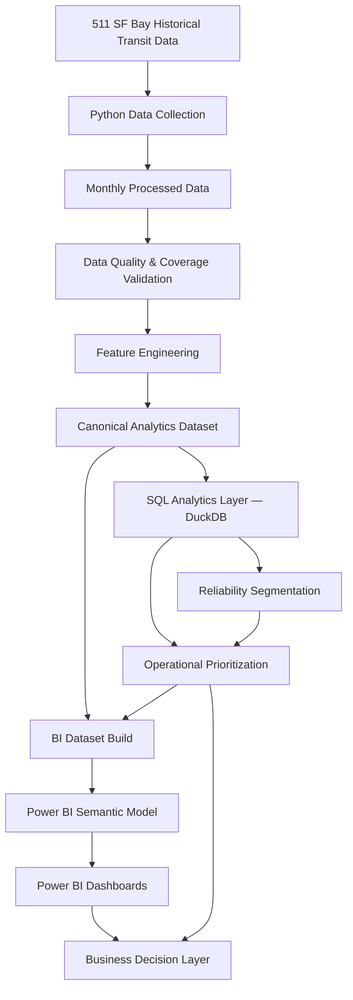

# Late Tax — Analytics Architecture

## End-to-End Pipeline

## Architecture Summary

### 1. Data Acquisition
Historical transit observations are collected and processed with Python-based extraction workflows.

### 2. Data Quality Layer
Before analysis, observations pass through validation and auditing for schema consistency, extraction completeness, route and temporal coverage, post-merge filtering, delay baselines, service-day semantics, and post-midnight observations.

### 3. Feature Engineering
Validated observations are transformed into a trip-level analytical dataset with delay metrics, route baselines, late-trip flags, severe-delay flags, Late Tax, time-period features, and calendar fields.

The analytical grain is one observed scheduled trip on one service date. The validated composite key is `service_date + trip_id`.

### 4. Canonical Analytics Dataset
The primary analytical table is `data/processed/late_tax_analytics.csv`. It contains 1,813 observed trips and serves as the common source for Python, SQL, operational analysis, and BI preparation.

### 5. SQL Analytics Layer
DuckDB SQL provides reproducible analysis using CTEs, conditional aggregation, GROUP BY, medians and percentiles, window functions, partitioned ranking, cumulative contribution analysis, and sample-size eligibility logic.

### 6. Operational Analytics
Route × time-period groups are evaluated using aggregate Late Tax burden, late-trip frequency, late-trip severity, and sample size.

Operational priority scoring combines 60% Late Tax burden, 25% late frequency, and 15% late severity. The score is a decision-support heuristic rather than a causal model.

### 7. BI Dataset Layer
Python produces Power BI-ready outputs:
- `data/bi/late_tax_dashboard.csv`
- `data/bi/operational_hotspots.csv`

### 8. BI Semantic Layer
Power BI uses a star-schema-style model with:
- FactTrips
- DimDate
- DimOperationalSegment

Reusable DAX measures support Total Trips, Late Trips, Late Trip %, Total Late Tax Minutes, Late Tax Share %, Average Late Severity, P95 Lateness, and Primary Hotspots.

### 9. Decision Layer
The dashboard supports executive reliability monitoring, operational hotspot prioritization, and detailed reliability diagnosis.

## Pipeline Outcome
	**Transit Data → Python → Data Quality → Feature Engineering → SQL/DuckDB → Operational Analytics → BI Modeling → Power BI → Business Recommendations**
